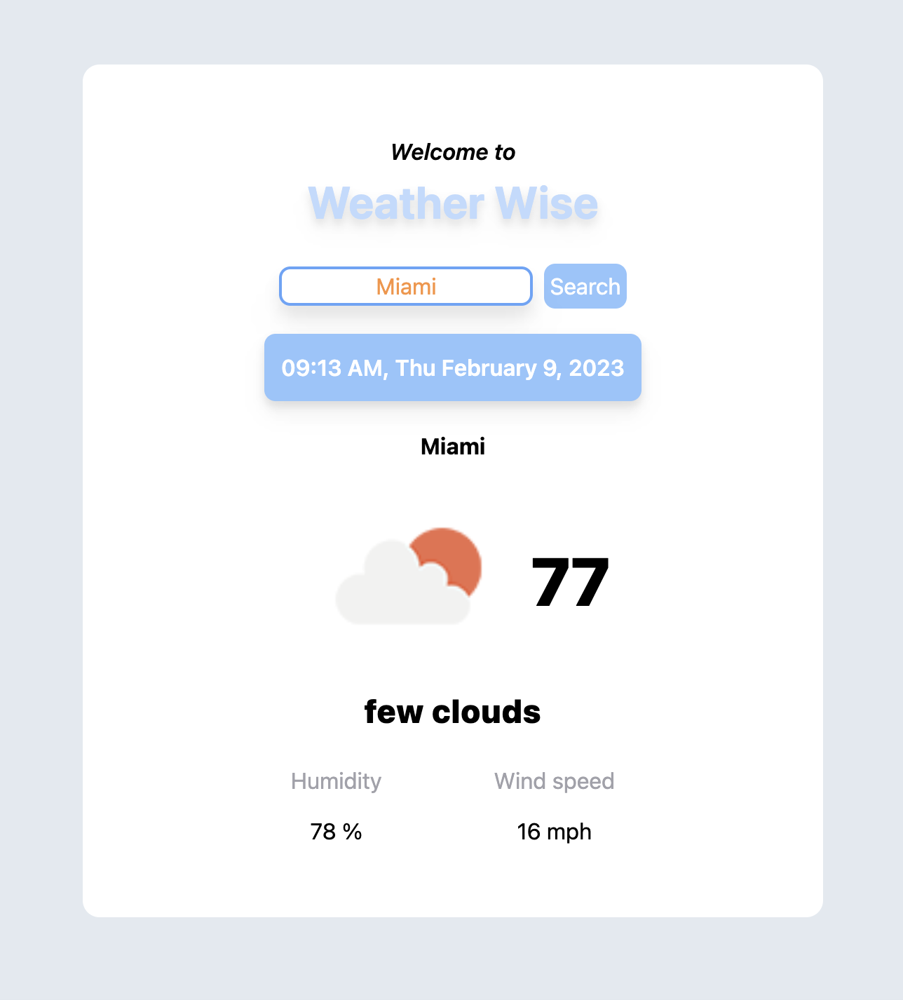

# Weather Wise Web App 🌦️

Project Link: (https://weather-wise-app.web.app)

## Lessons Learned

What did you learn while building this project? 

- During this project I learned how to handle state of components and how to pass props from a parent component
to a child and then child to parent component. Also practiced useEffect as well.

## Documentation

[React Documentation](https://beta.reactjs.org)

## 🔗 Links

<!-- Gh repo create miguelcamilo/Weather-Wise-Web-App --source=. --public --push -->